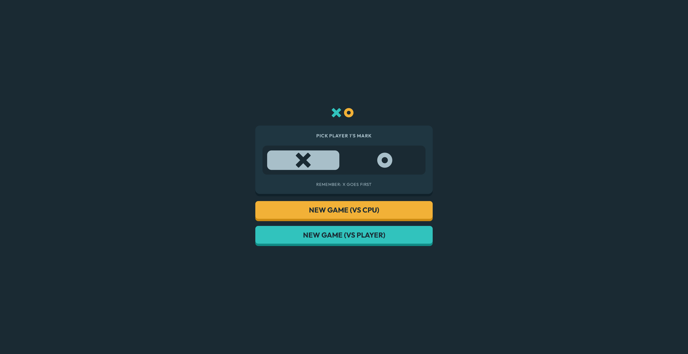
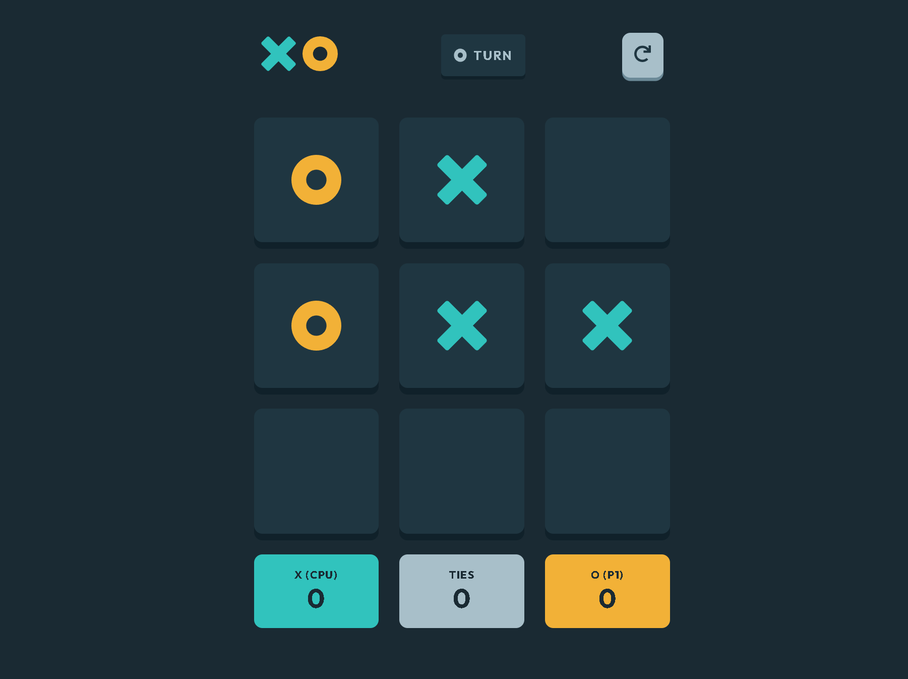
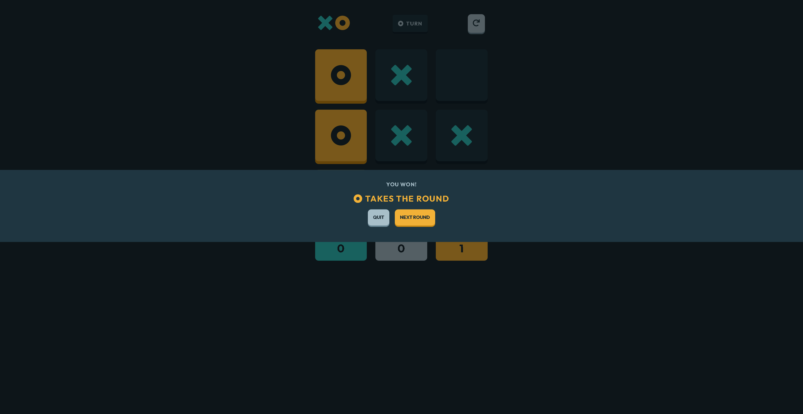
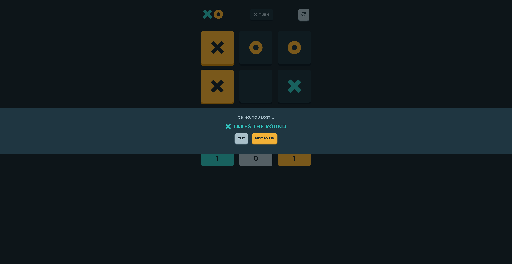
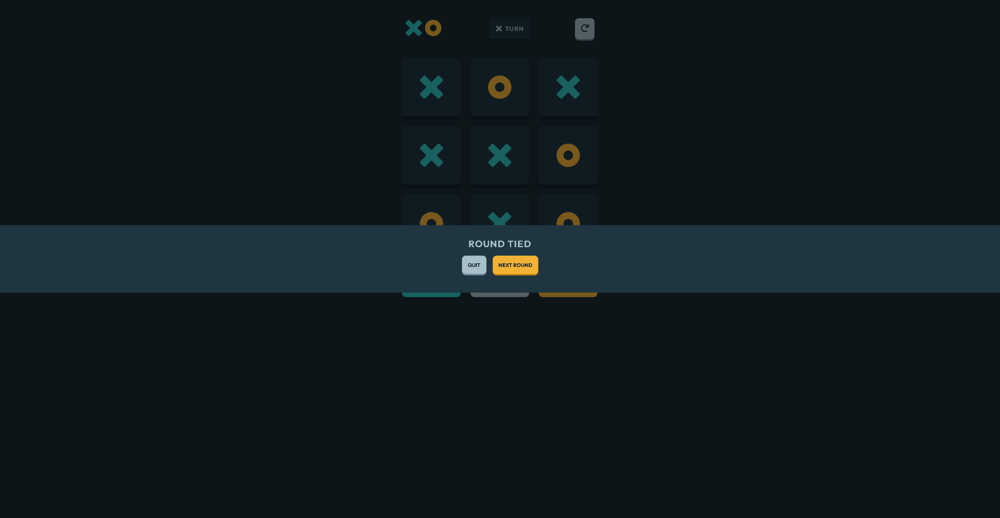

# Tic Tac Toe React App

Tic Tac Toe is a two-player game played on a 3x3 grid. The objective of the game is to get three of your symbols in a row, either horizontally, vertically, or diagonally. The symbols used in the game are "X" and "O".

Each player takes turns marking a square with their symbol. If one player is able to get three of their symbols in a row, they win the game. If all squares are filled and no player has won, the game is a draw.

In this version of Tic Tac Toe, the user starts at the main page where they can choose which symbol they want to use. Regardless of what they choose, X will always go first. The user also has the option to play against a CPU or play against a second player and take turns on the same device (there is no online mode). If the user chooses to play against a CPU, the CPU will choose a cell at random immediately after the user selects a cell.

Here is a link to the live website: https://peaceful-torte-909a46.netlify.app/

## Built With

- React/JSX
- React hooks
- React Router
- CSS
- SVG icons

## Gameplay

 
 

### The user will start at the home screen, where they will be prompted to select a symbol and start a new gave vs a second player or a cpu.

 
 

 
 

### The user will then be taken to the game screen, where they can play against a second player or a cpu. The user is also able to quit the game and return to the main page at any time by clicking on the back button on the top right corner. Here is an image of a player vs a cpu in action:

 
 

 
 

### If the user wins, a victory modal will pop up which allows them to choose to play again or return to the main page. The score tracker for player 1 increases by 1 each time the player (or player 1) wins

 
 

 
 

### If the user loses, a loss modal will pop up which allows them to choose to play again or return to the main page. The score tracker for player 2 increases by 1 each time the cpu (or player 2) wins

 
 

 
 

### If the game ends in a draw, a draw modal will pop up which allows them to choose to play again or return to the main page. The score tracker for the amount of ties also increases by 1 each time the game ends in a draw

 
 

 
 

## Installation Guide

These instructions will get you a copy of the project up and running on your local machine for development and testing purposes.

### Prerequisites

You will need to have Node.js and npm installed on your computer. You can download them from the official Node.js website: https://nodejs.org/en/

1. Clone this repository to your local machine:

    `git clone https://github.com/MasonBoom/Tic-Tac-Toe-React.git`

2. Go to the project directory:

    `cd tic-tac-toe-game`

3. Install the required dependencies:

    `npm install`

4. Start the development server:

    `npm start`

The app should now be running on `http://localhost:3000/` in your web browser.

## Author

- **Mason Boomgaard** - [MasonBoom](https://github.com/MasonBoom)
